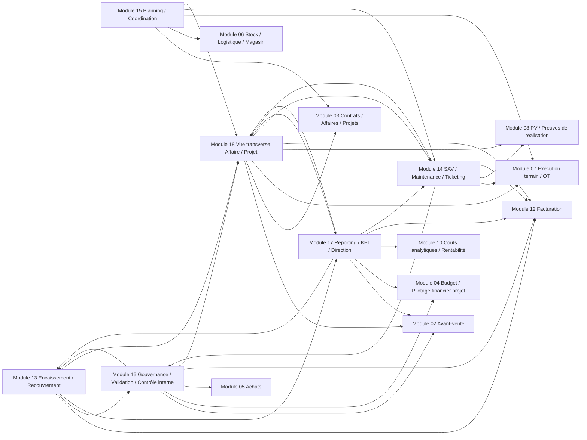

# Graphe documentaire

Ce graphe met en avant les dépendances documentaires principales entre modules.
Il ne remplace pas les liens détaillés dans chaque fiche, il les synthétise.
Les flèches représentent ici des liens documentaires forts, pas nécessairement un ordre chronologique strict.

- Relation -> [GRAPHE-LIENS.md](./GRAPHE-LIENS.md) : version plus détaillée avec sources racines, matrices et relations nommées.

