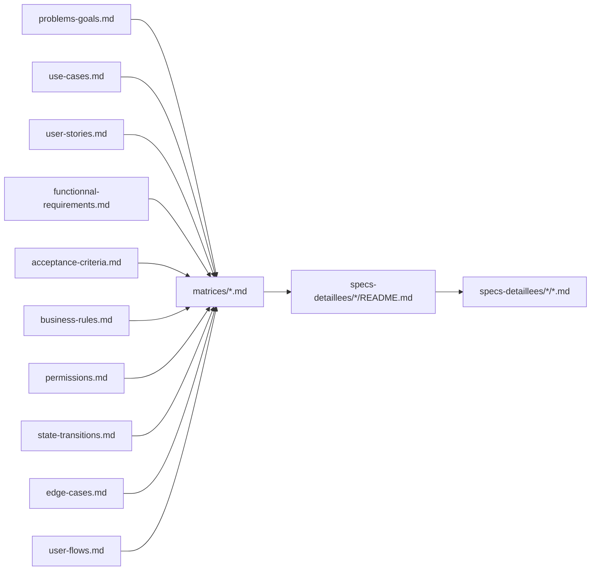
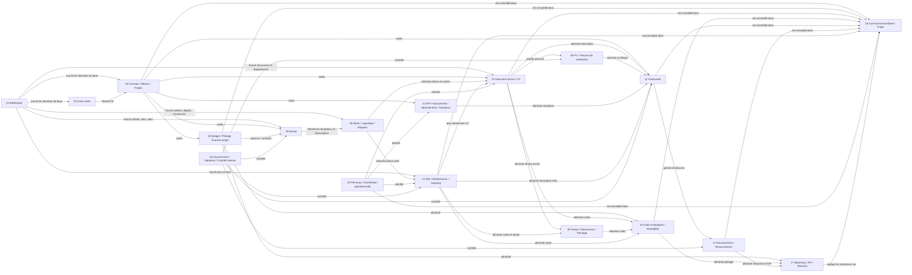

# Graphe des liens

Ce fichier donne une vue synthétique des relations entre :

- les documents sources du cadrage
- les matrices de synthèse
- les modules de spécification détaillée
- les principaux flux inter-modules

- Relation -> [GRAPHE-DOCUMENTAIRE.md](./GRAPHE-DOCUMENTAIRE.md) : version plus compacte centrée sur les liens forts entre modules.

## Légende des relations

- `S'appuie sur` : le contenu métier est dérivé ou précisé à partir du fichier source.
- `Contraint par` : le fichier cible porte une règle, un droit ou un changement d'état imposé.
- `Déclenche` : l'action décrite produit un objet ou une étape dans un autre module.
- `Alimente` : la donnée produite sert d'entrée métier à un autre module.
- `Dépend de` : le module a besoin du fichier cible comme prérequis.
- `Est consolidé dans` : la donnée est visible dans un cockpit, une vue transverse ou un reporting.
- `Partage le workflow avec` : la logique traverse plusieurs modules dans un même parcours.

## Graphe documentaire

## Graphe inter-modules

## Lecture recommandée

- Lire d'abord les `README.md` de module pour comprendre les dépendances globales.
- Descendre ensuite dans les fiches de flow pour voir les liens précis entre objets et écrans.
- Utiliser les matrices comme niveau de synthèse entre sources racines et spécifications détaillées.
